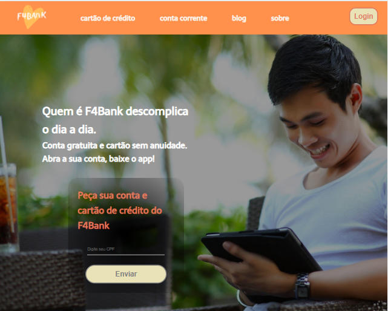
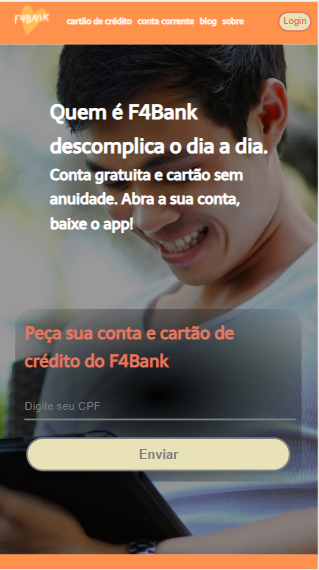

# Projeto F4Bank - Grupo 11 🚀

## O F4Bank é um projeto de um grande banco público brasileiro para competir com as startups que tem surgido, como Nubank, Banco Inter e Banco Neon. Você precisa criar uma landing page que comunique, além da proposta do banco, os produtos "Cartão sem taxa" e "Conta corrente digital", reforçando a segurança de um banco tradicional com décadas de história no país.

### Visite:

### Desenvolvedores: 
- Caio Sala Rigotto
- Camila Coradi Garcia Leal
- Francineide Teixeira da Silva

## Versão Desktop
<h1 align="center">
  
</h1>

## Versão Mobile

<h1 align="center">
  
</h1>

### Features

- [x] Cartão de crédito
- [x] Conta Corrente
- [x] Sobre
- [ ] Trabalhe Conosco
- [ ] FAQ/perguntas frequentes

### 🛠 Tecnologias

As seguintes ferramentas foram usadas na construção do projeto:

- [CSS]
- [HTML]

